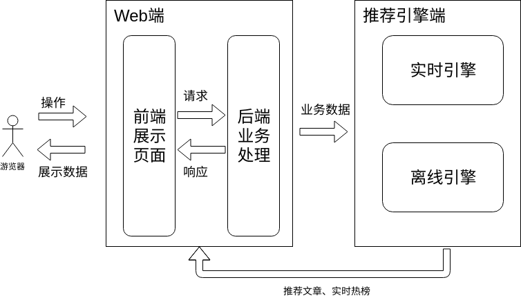
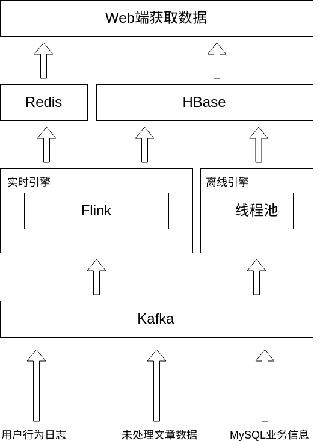
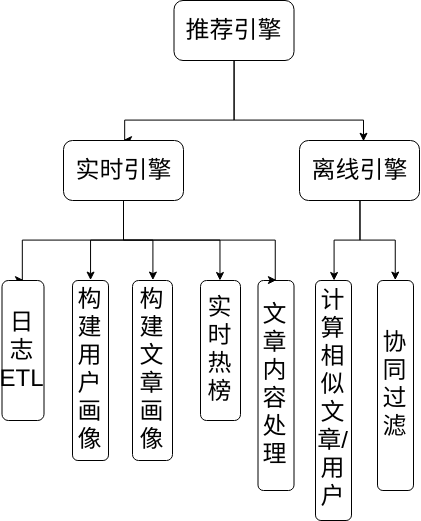

# AMS-recommendation-system
AMS实时推荐系统

## AMS设计思路

## 系统架构

推荐系统的数据源从Web端传来，其中包括用户的行为日志、未处理的文章内容等信息，利用Apache Kafka高效消息队列系统将数据以队列的形式发送下游推荐引擎来处理，这样实现了业务系统和推荐系统的解耦，同时也实现了高峰错流等机制，提高系统的抗压能力。推荐引擎则用Apache Flink分布式计算引擎高吞吐、低延迟的特点实时高效地处理，包括画像构建、日志ETL、实时热门文章计算等。另外，离线推荐引擎则暂时采用多个线程来并发处理，较为高效地计算相似文章、相似用户等。最终，推荐引擎处理数据存入HBase，该数据库的特点是高吞吐的实时读写，符合系统实时性的要求。

## 系统功能

